# Relatório de Bugs – Página de Inscrição para Certificação

## Objetivo
Avaliar a qualidade da página de certificação, considerando testes funcionais, não funcionais e de interface, com foco na experiência do usuário, validação de formulário, funcionamento dos botões e consistência visual da aplicação.  
O teste foi realizado de forma exploratória, simulando a navegação de um usuário interessado em se cadastrar para estudar e obter certificação.  

Itens avaliados:  
Formulário de cadastro, botões da página, links de redes sociais, textos exibidos na interface e aspectos gerais de usabilidade.

---

## Bugs Encontrados

### Item 1 – Botão “SAIBA MAIS” clicável sem ação

Descrição: O botão apresenta comportamento visual de elemento clicável, porém não executa nenhuma ação.  
Comportamento esperado: Direcionar para página com informações detalhadas sobre a certificação.  
Impacto: Frustração do usuário e quebra no fluxo de navegação.  
Tipo: Correção  
Classificação: Usabilidade  
Prioridade: Alta  

---

### Item 2 – Botão “QUERO ME CERTIFICAR” redireciona para página inicial

Descrição: Ao clicar, o usuário é levado à página inicial da empresa em vez do fluxo de inscrição.  
Comportamento esperado: Direcionar para formulário ou página específica da certificação.  
Impacto: Quebra no fluxo esperado.  
Tipo: Correção  
Classificação: Utilidade  
Prioridade: Alta  

---

### Item 3 – Indicação de etapas do formulário (1/2) sem clareza
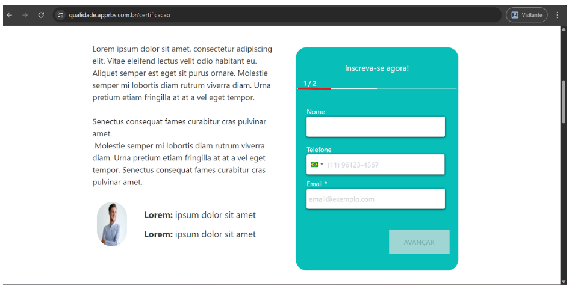
Descrição: O formulário mostra “1/2” sem explicar o fluxo.  
Comportamento esperado: Informar claramente múltiplas etapas ou indicar o que será solicitado.  
Impacto: Incerteza no processo de inscrição.  
Tipo: Melhoria  
Classificação: Usabilidade  
Prioridade: Média  

---

### Item 4 – Campo Nome aceita números
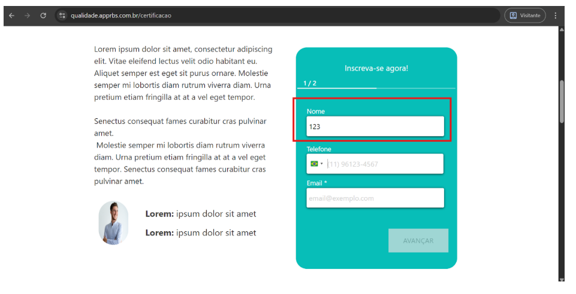
Descrição: Permite inserir números no campo Nome.  
Comportamento esperado: Aceitar apenas letras e espaços.  
Impacto: Cadastro com dados inválidos.  
Tipo: Correção  
Classificação: Utilidade  
Prioridade: Alta  

---

### Item 5 – Validação insuficiente no campo Email
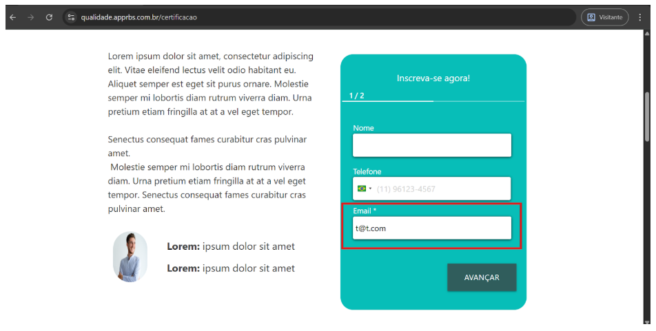
Descrição: Aceita valores simplificados como t@t.com.  
Comportamento esperado: Validar formatos robustos de e-mail.  
Impacto: Cadastro com e-mails inválidos.  
Tipo: Correção  
Classificação: Utilidade  
Prioridade: Média  

---

### Item 6 – Campo Telefone sem orientação clara
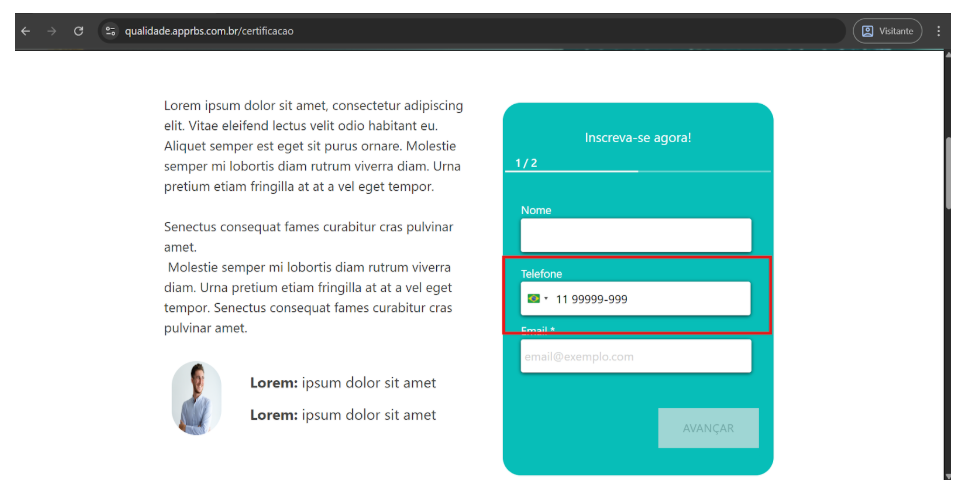
Descrição: Aceita apenas números e aplica formatação, mas não informa ao usuário.  
Comportamento esperado: Exibir máscara ou instrução clara.  
Impacto: Dúvida no preenchimento.  
Tipo: Melhoria  
Classificação: Usabilidade  
Prioridade: Baixa  

---

### Item 7 – Mensagens de validação pouco claras
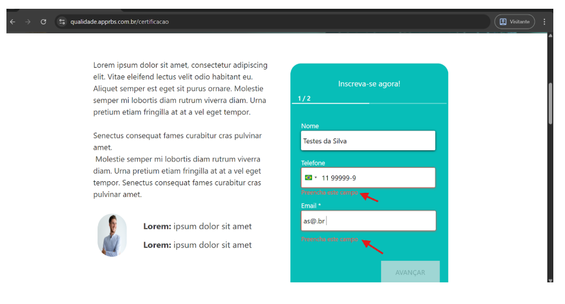
Descrição: Apenas aviso genérico em vermelho.  
Comportamento esperado: Informar motivo específico (nome inválido, e-mail incorreto etc.).  
Impacto: Dificulta correção pelo usuário.  
Tipo: Melhoria  
Classificação: Usabilidade  
Prioridade: Média  

---

### Item 8 – Botão “AVANÇAR” apresenta erro de base legal
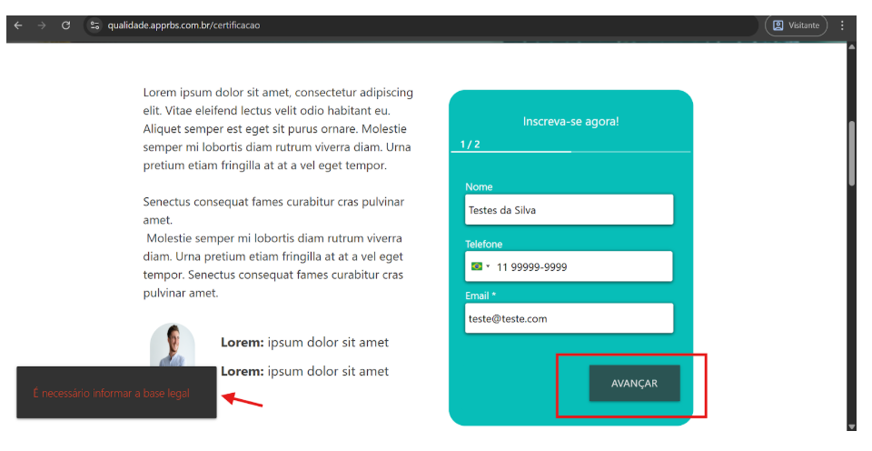
Descrição: Após preencher corretamente, aparece mensagem sobre “base legal” inexistente.  
Comportamento esperado: Permitir avanço para próxima etapa.  
Impacto: Impede continuidade do cadastro.  
Tipo: Correção  
Classificação: Utilidade  
Prioridade: Alta  

---

### Item 9 – Botão “Quero me certificar” na seção intermediária redireciona incorretamente
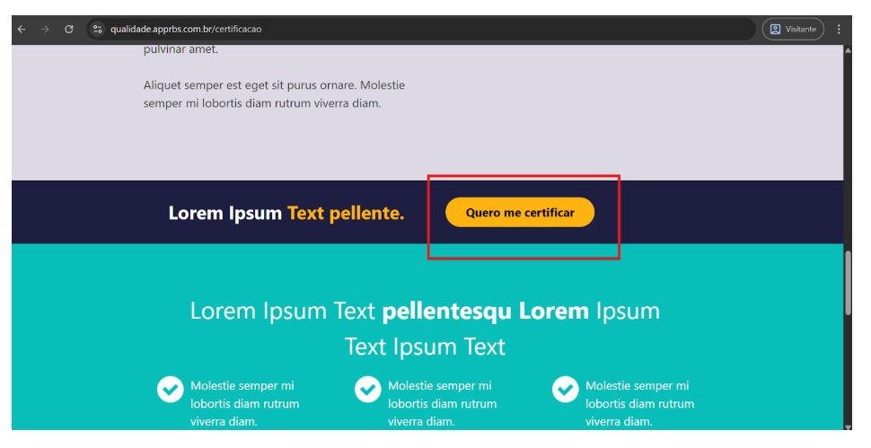
Descrição: Redireciona para página não relacionada à certificação.  
Comportamento esperado: Direcionar para fluxo de inscrição.  
Impacto: Quebra no fluxo de navegação.  
Tipo: Correção  
Classificação: Utilidade  
Prioridade: Alta  

---

### Item 10 – Cards “Outros cursos” sem ação de navegação
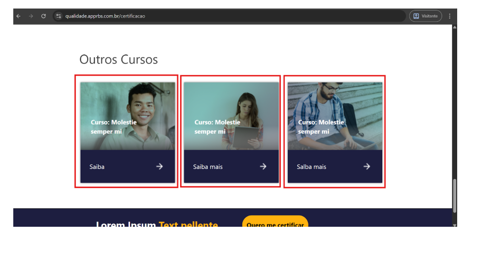
Descrição: Cards e botões “Saiba mais” não executam ação.  
Comportamento esperado: Redirecionar para página com informações do curso.  
Impacto: Usuário não acessa detalhes dos cursos.  
Tipo: Correção  
Classificação: Utilidade  
Prioridade: Alta  

---

### Item 11 – Inconsistência de texto nos botões dos cards
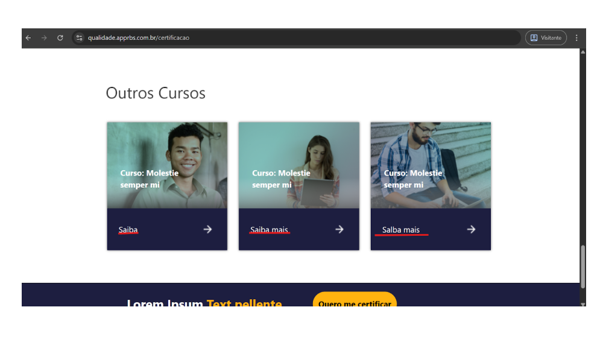
Descrição: Um card mostra “Saiba”, outros “Saiba mais”.  
Comportamento esperado: Padronizar textos.  
Impacto: Falta de consistência visual.  
Tipo: Melhoria  
Classificação: Desejabilidade  
Prioridade: Baixa  

---

### Item 12 – Botões “Saiba mais” dos cards não executam ação
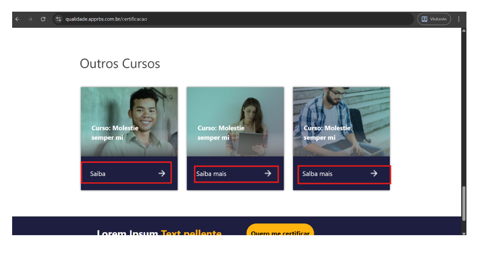
Descrição: Ao clicar nos botões “Saiba mais” nenhuma ação ou redirecionamento é executado.  
Comportamento esperado: Direcionar para página com informações detalhadas sobre o curso selecionado.  
Impacto: Usuário não consegue acessar informações adicionais.  
Tipo: Correção  
Classificação: Utilidade  
Prioridade: Alta  

---

### Item 13 – Botão “Quero me certificar” inferior redireciona para Google
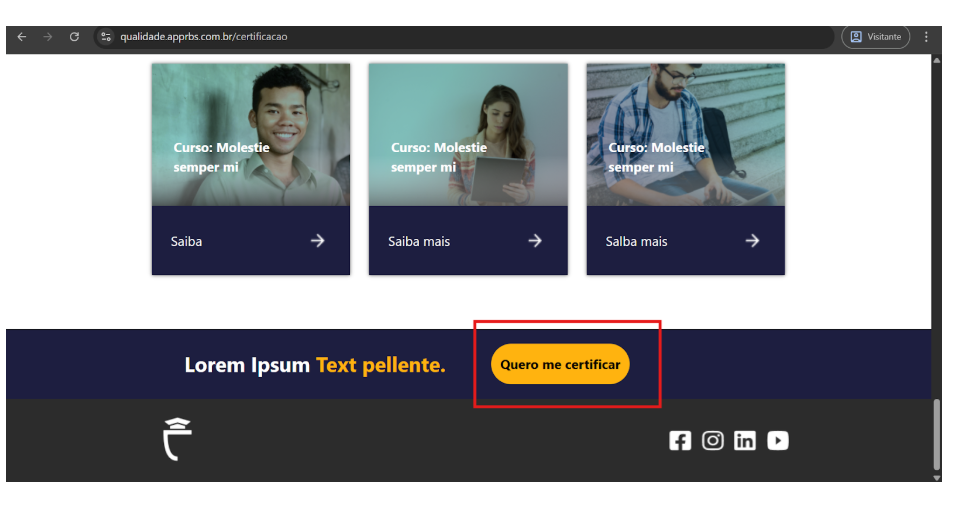
Descrição: Redireciona para página externa não relacionada.  
Comportamento esperado: Direcionar para fluxo de inscrição.  
Impacto: Interrompe fluxo esperado.  
Tipo: Correção  
Classificação: Utilidade  
Prioridade: Alta  

---

### Item 14 – Ícone de rede social incorreto
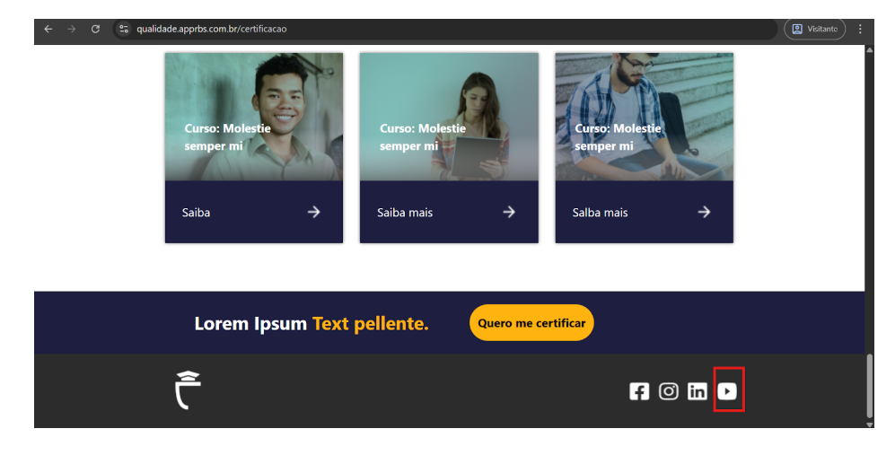
Descrição: Ícone do YouTube leva para outra rede social.  
Comportamento esperado: Cada ícone deve levar à sua plataforma correta.  
Impacto: Inconsistência de navegação e credibilidade.  
Tipo: Correção  
Classificação: Usabilidade  
Prioridade: Média  

---

## Melhorias Identificadas

1. Melhorar validações do formulário  
2. Aplicar máscara no telefone  
3. Exibir feedback após envio do formulário  
4. Revisar links e navegação da página  
5. Revisar textos e conteúdo da interface  
6. Melhorar consistência visual e padronização  

---

## Pontos de Prioridade

**Alta prioridade**  
- Campo nome aceita números  
- Validação de e-mail insuficiente  
- Falhas de navegação em botões principais da página  

**Média prioridade**  
- Links de redes sociais incorretos  
- Telefone sem orientação de preenchimento  
- Inconsistências de texto na interface  

---

## Conclusão
Durante os testes foram identificados problemas funcionais, de navegação e de interface que impactam diretamente a experiência do usuário. Os principais riscos estão relacionados à validação inadequada de dados no formulário e a falhas em elementos interativos da página, como botões e links que não executam as ações esperadas. Também foram observadas inconsistências visuais e textuais que podem afetar a credibilidade da aplicação.  
A correção dos problemas identificados e a implementação das melhorias sugeridas podem contribuir para tornar o fluxo de inscrição mais claro, confiável e eficiente para o usuário.