# 📋 Relatório de Teste – Página Institucional da Faculdade

## Objetivo
Avaliar a qualidade da página institucional da faculdade, considerando testes funcionais, validações de formulário, navegação entre seções da página, funcionamento de botões e consistência da interface.  
O teste foi realizado de forma exploratória, simulando a navegação de um usuário interessado em conhecer a instituição, acessar informações sobre cursos, eventos e realizar inscrição ou contato.

## Itens avaliados
Durante a execução dos testes foi realizada uma análise da navegação da página institucional da faculdade, considerando o comportamento dos principais elementos interativos disponíveis ao usuário. Foram observados aspectos relacionados ao funcionamento dos botões de ação, navegação entre seções da página, comportamento do carrossel de cursos, funcionamento da seção de eventos, validação dos campos presentes no formulário de newsletter e consistência dos links disponíveis no cabeçalho e no rodapé da página.  
A avaliação também considerou a experiência de navegação do usuário, verificando se os elementos apresentados na interface executam as ações esperadas e se o fluxo de interação ocorre de forma clara e consistente.

---

## Cenários encontrados

### Item 1 - Ícone de telefone da área de atendimento redireciona para destino incorreto
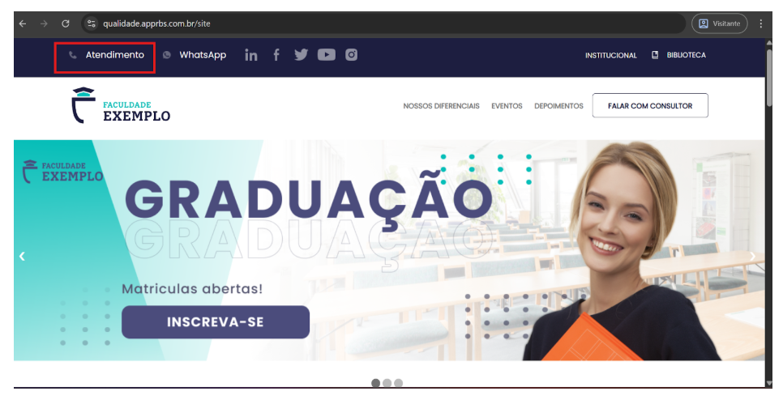
Descrição: Na barra superior da página, o ícone de telefone localizado na seção de atendimento redireciona o usuário para o WhatsApp.  

Comportamento esperado: O ícone de telefone deveria direcionar para um canal compatível com atendimento telefônico ou chatbot, conforme a proposta visual e funcional do elemento.  

Impacto: Pode gerar confusão no usuário, pois o ícone apresentado não corresponde ao destino acessado.  

Tipo: Melhoria  
Classificação: Desejabilidade  
Prioridade: Baixa

---

### Item 2 - Link “NOSSOS DIFERENCIAIS” abre página externa antes de posicionar o usuário na seção correta
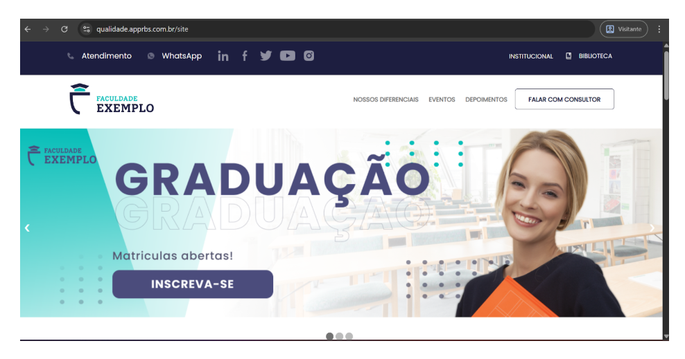
Descrição: Ao clicar na opção “NOSSOS DIFERENCIAIS”, o sistema abre uma nova guia para o site da empresa, sem necessidade. Após o fechamento da guia e retorno à landing page, o usuário é posicionado na seção correta dentro do próprio site.  

Comportamento esperado: O link deveria apenas rolar a página até a seção correspondente dentro da própria landing page, sem abrir guia externa.  

Impacto: Gera navegação inconsistente e quebra de fluxo para o usuário.  

Tipo: Melhoria  
Classificação: Desejabilidade  
Prioridade: Baixa

---

### Item 3 - Link “EVENTOS” abre página externa antes de posicionar o usuário na seção correta
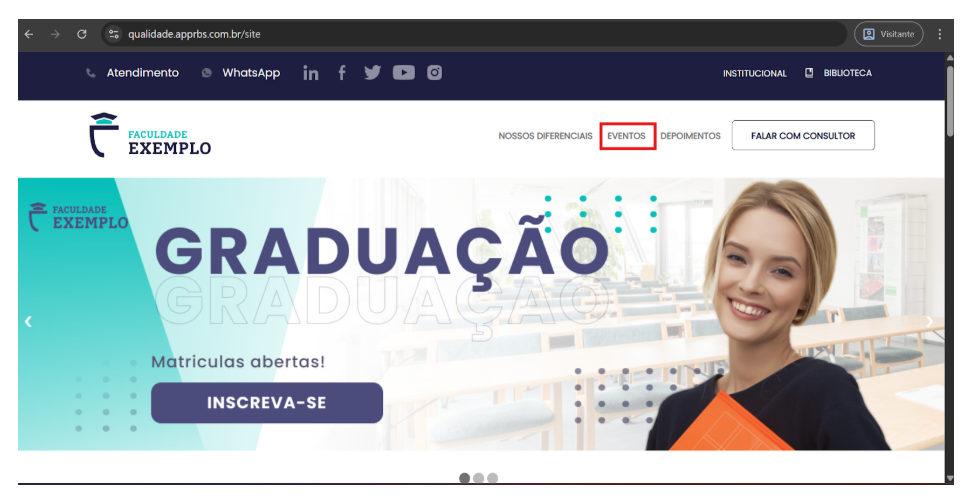
Descrição: Ao clicar na opção “EVENTOS”, o sistema abre uma nova guia para o site da empresa. Ao retornar para a página original, o usuário é direcionado para a seção correta da landing page.  

Comportamento esperado: O link deveria apenas levar o usuário diretamente para a seção “EVENTOS” dentro da própria página, sem abrir guia externa.  

Impacto: Prejudica a experiência de navegação e pode confundir o usuário quanto ao comportamento esperado do menu.  

Tipo: Melhoria  
Classificação: Desejabilidade  
Prioridade: Baixa

---

### Item 4 - Link “DEPOIMENTOS” abre página externa antes de posicionar o usuário na seção correta
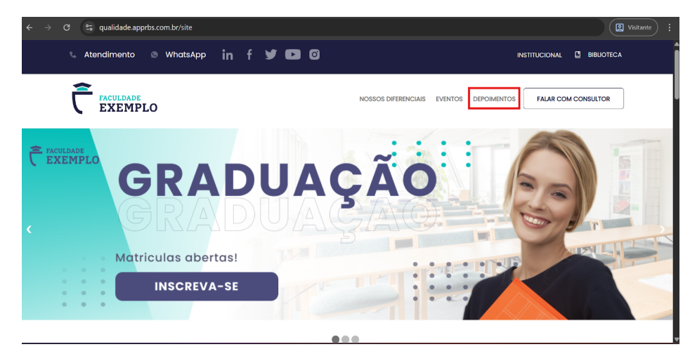
Descrição: Ao clicar na opção “DEPOIMENTOS”, o sistema abre uma nova guia para o site da empresa. Após retornar à página original, o usuário é direcionado para a seção correspondente dentro da landing page.  

Comportamento esperado: O link deveria apenas rolar a página até a seção “DEPOIMENTOS”, sem abrir nova guia ou site externo.  

Impacto: Quebra o fluxo de navegação e gera comportamento incoerente com uma landing page.  

Tipo: Melhoria  
Classificação: Desejabilidade  
Prioridade: Baixa

---

### Item 5 - Botão “FALAR COM CONSULTOR” não direciona para canal de atendimento adequado
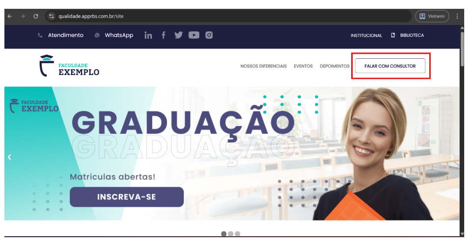
Descrição: O botão “FALAR COM CONSULTOR” apresenta visual de chamada para atendimento, porém o comportamento esperado seria direcionar o usuário para um canal direto de contato, como chatbot ou atendimento imediato, não abrir o WhatsApp.  

Comportamento esperado: O botão deveria abrir o chatbot, canal de atendimento ou fluxo direto de contato com consultor.  

Impacto: Pode dificultar o acesso rápido ao atendimento e comprometer a conversão do usuário interessado.  

Tipo: Melhoria  
Classificação: Desejabilidade  
Prioridade: Baixa

---

### Item 6 - Botões do carrossel principal não executam ação
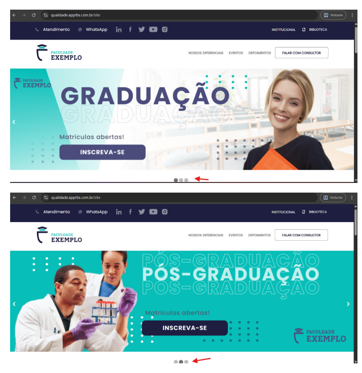
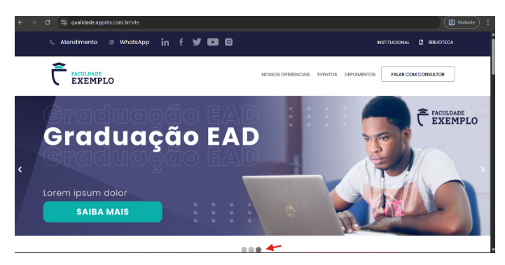
Descrição: A seção principal da página apresenta um carrossel de cursos contendo diferentes slides, como:  
- Graduação – botão “INSCREVA-SE”  
- Pós-graduação – botão “INSCREVA-SE”  
- Graduação EAD – botão “SAIBA MAIS”  

Apesar de exibirem aparência de elementos interativos, nenhum dos botões executa ação ao ser clicado.  

Comportamento esperado: Cada botão do carrossel deveria direcionar o usuário para a ação correspondente, como:  
- iniciar processo de inscrição  
- abrir página com mais informações do curso  

Impacto: Impede que o usuário prossiga com as ações principais da página e compromete a navegação.  

Tipo: Melhoria  
Classificação: Desejabilidade  
Prioridade: Baixa

### Item 7 - Botões “INSCREVA-SE AGORA!” da seção “Próximos Eventos” redirecionam para página incorreta
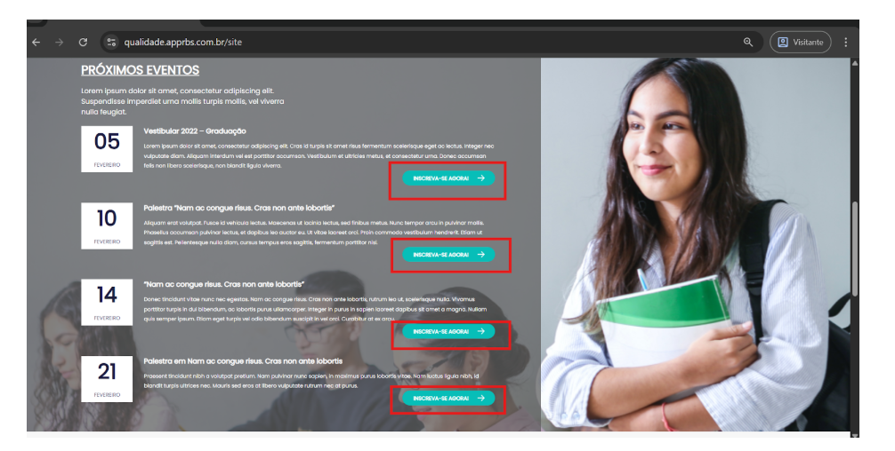
Descrição: Na seção “Próximos Eventos”, são exibidos eventos com data, descrição e o botão “INSCREVA-SE AGORA!” para participação. Ao clicar nos botões de inscrição dos eventos apresentados, o usuário é redirecionado para uma página que não está relacionada ao evento selecionado, não permitindo a inscrição ou acesso a informações adicionais sobre o evento.  

Comportamento esperado: Ao clicar em “INSCREVA-SE AGORA!”, o usuário deveria ser direcionado para uma página de inscrição do evento ou para um formulário relacionado ao evento selecionado.  

Impacto: Impede o usuário de realizar a inscrição nos eventos divulgados e compromete o objetivo da seção.  

Tipo: Melhoria  
Classificação: Desejabilidade  
Prioridade: Baixa

---

### Item 8 - Campo “Nome” permite inserção de valores numéricos
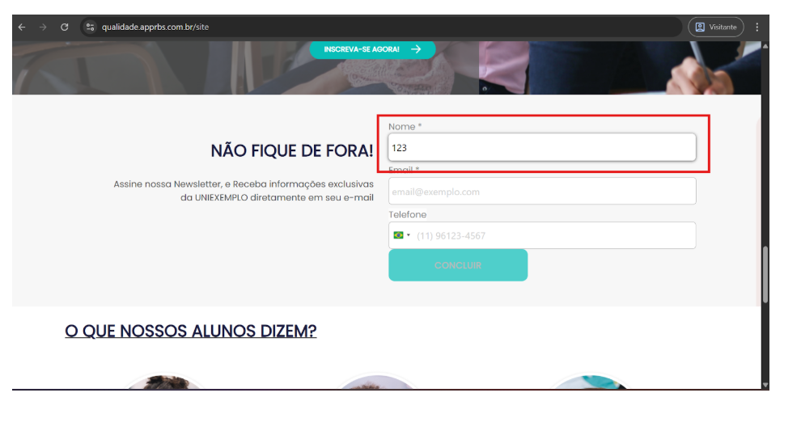
Descrição: No formulário da seção Newsletter, o campo Nome permite a inserção de valores numéricos, como por exemplo "123".  

Comportamento esperado: O campo deveria aceitar apenas letras e espaços, considerando que se trata de um campo destinado ao nome do usuário.  

Impacto: Permite o envio de dados inválidos no formulário.  

Tipo: Melhoria  
Classificação: Desejabilidade  
Prioridade: Baixa

---

### Item 9 - Validação insuficiente no campo “Email”
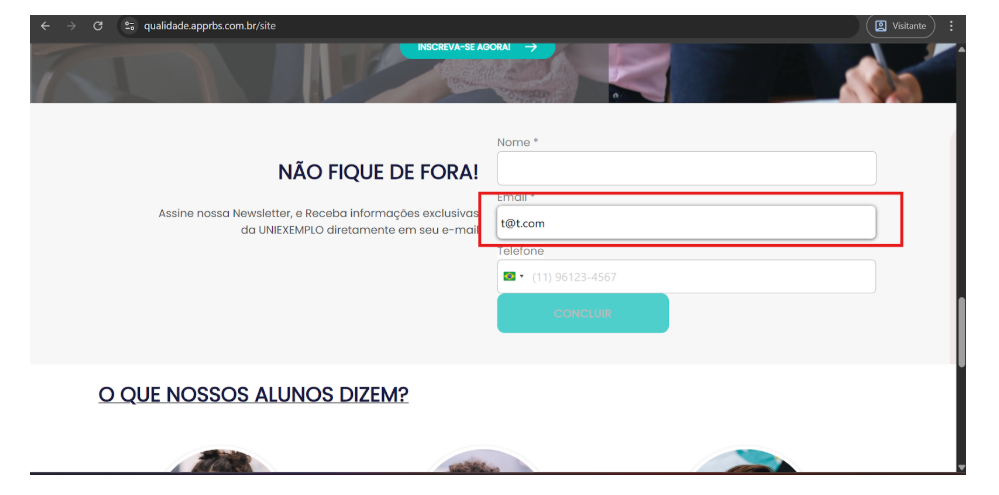
Descrição: O campo Email aceita valores com formatação simplificada, como t@t.com, indicando validação superficial.  

Comportamento esperado: O sistema deveria validar formatos de e-mail de forma mais robusta, garantindo que o endereço informado seja válido.  

Impacto: Possibilita cadastro com e-mails inválidos ou inexistentes.  

Tipo: Melhoria  
Classificação: Desejabilidade  
Prioridade: Baixa

---

### Item 10 - Campo “Telefone” não apresenta orientação clara de preenchimento
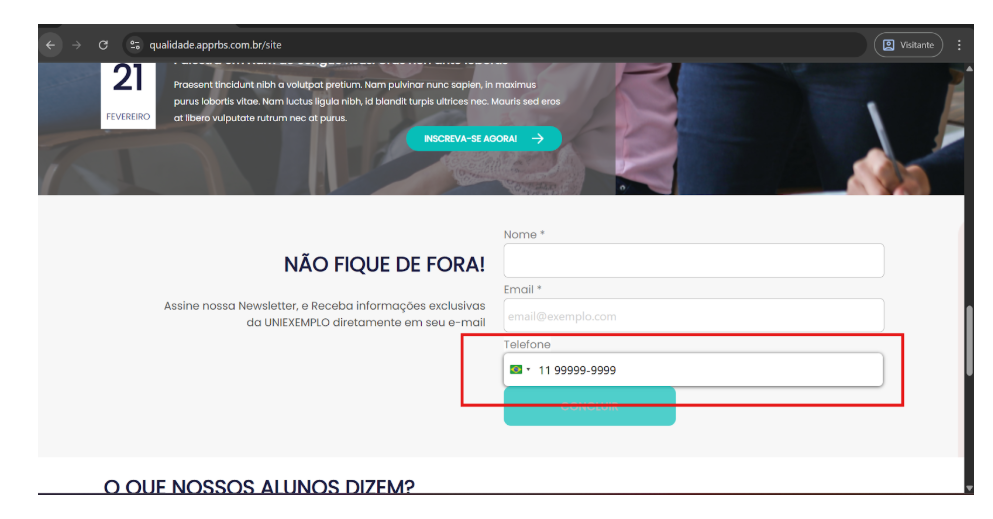
Descrição: O campo Telefone permite inserção de números, porém não apresenta orientação clara sobre o formato esperado para preenchimento.  

Comportamento esperado: O campo deveria apresentar máscara ou instrução indicando o formato esperado, como por exemplo (11) 99999-9999.  

Impacto: Pode gerar dúvida no preenchimento e aumentar a chance de erro por parte do usuário.  

Tipo: Melhoria  
Classificação: Desejabilidade  
Prioridade: Baixa

---

### Item 11 - Mensagem de erro genérica ao validar campos obrigatórios
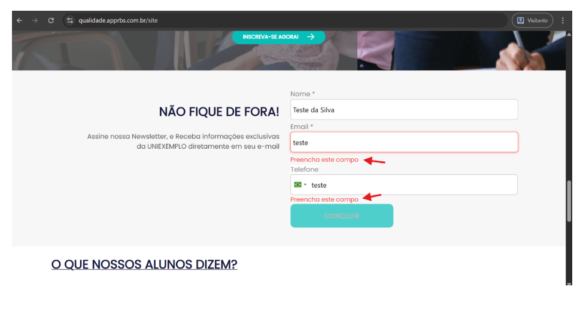
Descrição: Quando os campos do formulário não são preenchidos corretamente, o sistema apresenta apenas uma mensagem genérica solicitando o preenchimento dos campos, sem indicar qual campo está incorreto.  

Comportamento esperado: O sistema deveria apresentar mensagens específicas indicando qual campo contém erro e qual correção é necessária.  

Impacto: Dificulta a correção do erro pelo usuário.  

Tipo: Melhoria  
Classificação: Desejabilidade  
Prioridade: Baixa

---

### Item 12 - Formulário apresenta erro de validação para campo inexistente
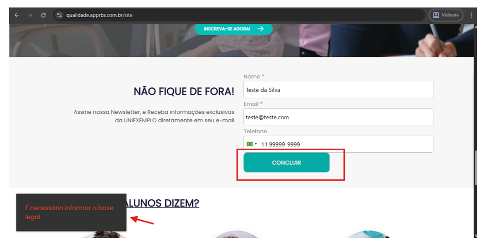
Descrição: Após preencher os campos com dados válidos, como:  
- Nome: Teste da Silva  
- Email: teste@teste.com  
- Telefone: (11) 99999-9999  

ao clicar no botão “Concluir”, o sistema apresenta a mensagem de erro “É necessário informar a base legal”, apesar de não existir nenhum campo relacionado a base legal disponível no formulário.  

Comportamento esperado: Após o preenchimento correto dos campos obrigatórios, o sistema deveria permitir o envio do formulário.  

Impacto: Impede a conclusão do envio do formulário e gera confusão para o usuário.  

Tipo: Melhoria  
Classificação: Desejabilidade  
Prioridade: Baixa

---

### Item 13 - Conteúdo placeholder exibido na seção de endereço
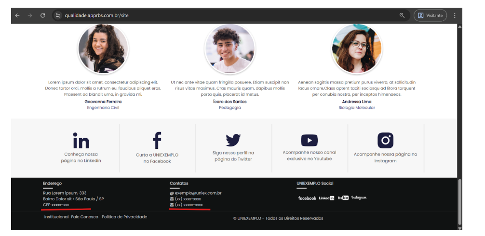
Descrição: Na seção de endereço do rodapé são exibidas informações genéricas como “Rua Lorem ipsum”, “CEP XXXXX-XXX” e (XX) XXXXX-XXXX indicando possível conteúdo de teste ou placeholder.  

Comportamento esperado: O rodapé deveria apresentar informações reais de endereço e contato da instituição.  

Impacto: Pode comprometer a credibilidade da página institucional.  

Tipo: Melhoria  
Classificação: Desejabilidade  
Prioridade: Baixa

---

## Melhorias Identificadas
- Melhorar validações do formulário: implementar validações mais robustas para os campos de nome, telefone e e-mail, garantindo que apenas dados válidos sejam aceitos.  
- Apresentar mensagens de erro mais claras: exibir mensagens específicas indicando qual campo contém erro e qual correção é necessária, facilitando o entendimento do usuário.  
- Orientar formato de preenchimento do telefone: adicionar máscara ou instrução de preenchimento no campo telefone para melhorar a experiência do usuário.  
- Padronizar comportamento de botões e links: garantir que todos os botões e elementos interativos executem as ações esperadas e direcionem corretamente para o fluxo correspondente.  
- Revisar navegação entre seções da página: em páginas do tipo landing page, os links do menu deveriam apenas rolar a página até a seção correspondente, evitando abrir novas guias ou páginas externas desnecessárias.  
- Revisar conteúdos de placeholder: substituir textos genéricos ou conteúdos de teste utilizados durante o desenvolvimento por informações reais da instituição.  

---

## Pontos de Prioridade
- **Alta prioridade**  
  - Falhas de navegação em botões principais da página  
  - Botões do carrossel sem ação  
  - Inscrição de eventos direcionando para páginas incorretas  
  - Erro de validação impedindo envio do formulário  

- **Média prioridade**  
  - Validação insuficiente de campos do formulário  
  - Mensagens de erro genéricas ou pouco claras  

- **Baixa prioridade**  
  - Conteúdos placeholder no rodapé  
  - Falta de orientação no preenchimento de telefone  

---

## Conclusão
Durante os testes foram identificados problemas funcionais e de navegação que impactam diretamente a experiência do usuário e o fluxo esperado da página. Os principais riscos estão relacionados a botões que não executam as ações esperadas, redirecionamentos incorretos em seções importantes e validações inadequadas no formulário de cadastro.  

Além disso, foram observadas oportunidades de melhoria na clareza das mensagens de erro, na orientação de preenchimento dos campos e na consistência geral da navegação da página. A correção dos pontos identificados pode contribuir para uma experiência mais clara, confiável e eficiente para os usuários interessados nos cursos e serviços da instituição.